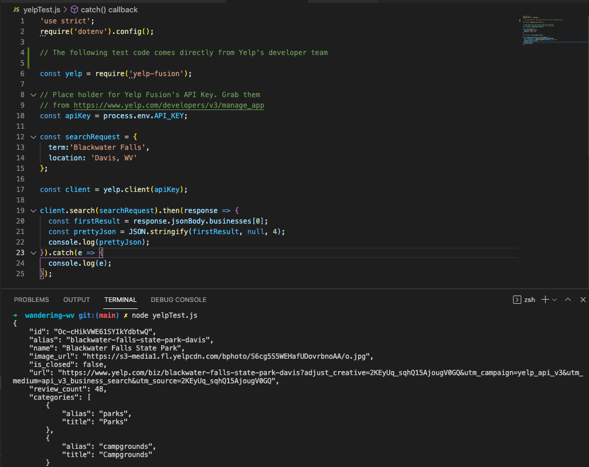

# Proposal

Requirements for the weekend

`1` An application name / concept 
```text
Wandering WV
```

`2` A repo for your project 2 (built from express_auth template)
```text
https://github.com/amanda-posey/wandering-wv
```

`3` Wireframe for your app - (Lucidchart)


`4` An ERD with two models (minimum) > User + 1 Resource (one to many) - (Lucidchart)


`5` Create (3-5) User Stories for the base user experience - ( [Reference](https://revelry.co/resources/development/user-stories-that-dont-suck/) )
```text
1. When I'm on a road trip, I want to find things to do/see/visit in WV.
2. I live in WV and need ideas for local places to visit for day or weekend trips.
3. I homeschool my children and want to take them on educational field trips.
```

`6` Resource's Restful Routing table ( [Readme](https://romebell.gitbook.io/sei-412/node-express/00readme-1/01intro-to-express/00readme#restful-routing) )

| VERB | URL | ACTION | DESCRIPTION
| ----------- | ----------- | ----------- | ----------- |
| GET | /index | Index (Read) | displays homepage
| GET | /places/:id | Show (Read) | displays individual post
| POST | /comment/ | Create (Create) | creates new comment
| PUT | /comment/:id| Update (Update) | edit comment
| DELETE | /comment/:id| Destroy (Delete) | deletes a comment


`7` Find API and test to see if you can get data ( *be able to print data in the console using Axios, Node-Fetch, and/or Postman* )

